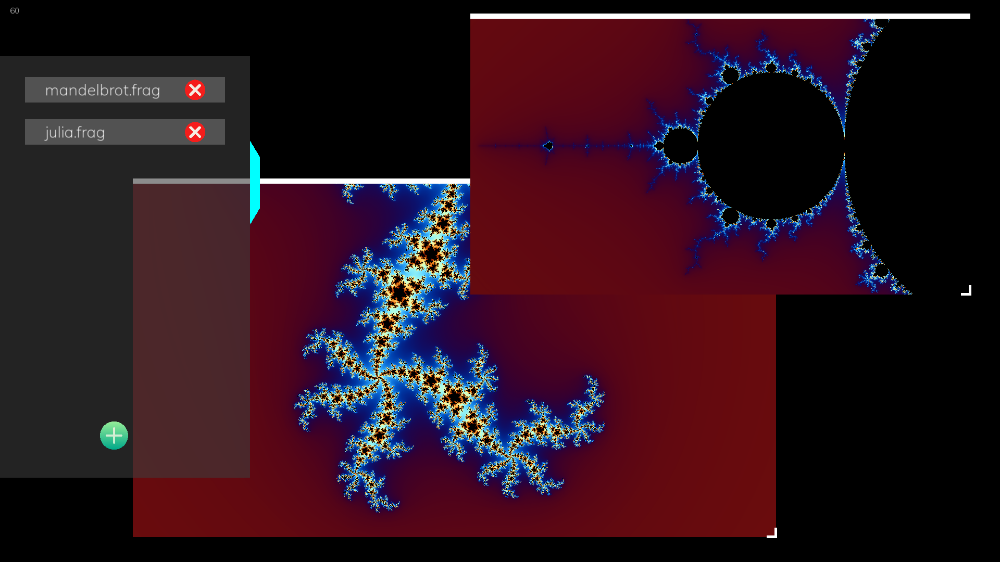

# ShaderTester
## Установка
Скачать архив в релизах, распаковать и запустить
## Использование
Открыть боковую панель, выбрать нужный шейдер (расширение файла может быть любым).

Появится окошко, в котором будет рендериться выбранный шейдер, в меню появится соответсвующий пункт с названием шейдера.

Окошо можно перетаскивать за верхнюю панель и изменять размер, двигая значок в нижнем правом углу.

В боковом меню можно закрыть ненужные шейдеры, одновременно может быть открыто до 7 шейдеров.

Чтобы выйти - нажмите Escape
## Демонстрация


В папке res находятся шейдеры для множества Мандельброта и множества Жюлиа.

В качестве примера также есть [шейдер](https://www.shadertoy.com/view/mlS3DV), взятый с shadertoy.
## Особенности шейдеров
Программа задает следующие параметры
```c++
uniform vec2 iResolution; //разрешение окна шейдера
uniform vec2 windowRes; // разрешение экрана 
uniform float iTime; //время в секундах с запуска программы
uniform vec3 iMouse; 
//xy - последние координаты мышки, меняются только при зажатой ПКМ;
//z - меняется при нажатии колёсика мыши (0 <-> 1), можно использовать как режим шейдера 
uniform vec2 offset; //сдвиг шейдера
uniform float globalScale; //увеличение
```
Для правильного отображения *нужно* в коде шейдера прибавлять offset к gl_FragCoord. 
Это позволит перемещать шейдер при зажатой ПКМ и правильно позиционировать его в окне.

Чтобы можно было приближаться в любую точку шейдера, преобразование координат должно выглядеть следующим образом:
```c++
vec2 uv = ((gl_FragCoord.xy+offset)*2.0 - iResolution.xy) / iResolution.y / globalScale;
//Первая часть стандартная - приводит коориданты от -1 до 1 по оси y 
//При делении на globalScale координаты соответственно растягиваются/сжимаются
```
Приближение происходит с помощью колёсика мыши.

Если не удалось загрузить шейдер, то будет выбран стандартный, а в консоль выведется дополнительная информация об ошибке.
